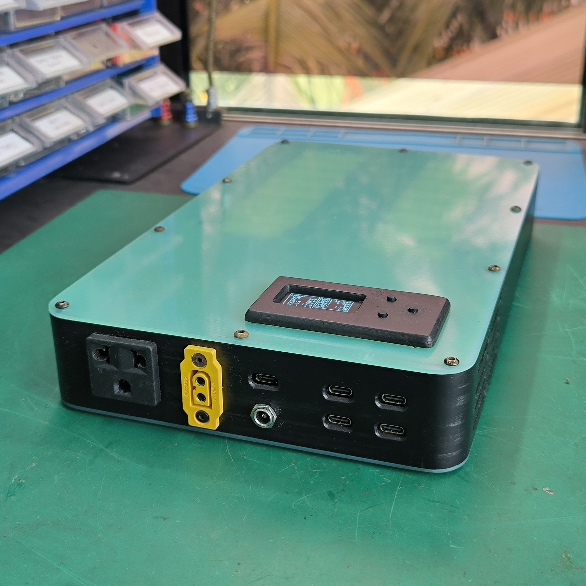

# Omnibus 4X8

The Omnibus 4X8 is a custom-designed power bank engineered as a highly versatile portable power platform. It integrates high-density energy storage, Arduino-based control, extensive power input and output interfaces, and layered protection systems. This makes it a dependable all-in-one power solution capable of supporting a wide range of applications and operating conditions.

## Key Features
* 4S8P 18650 battery configuration (up to 414 Wh with 3500 mAh cells)
* Compact 290x175x45 mm form factor and weighs 2.4 kg
* Arduino control and automation with ESP32-C3 microcontroller
* Informative 1.3” OLED display with intuitive 3-way navigation button
* Customisable APO (auto power off) function
* STA and AP Wi-Fi function for OTA firmware flashing
* Programmable bidirectional DC port (up to 20V 6A) based on SC8812A chip
* Constant voltage and constant current regulation in output mode
* Adaptive charging current in input mode or automatic tracking in MPPT mode
* 100W bidirectional USB-C port based on IP2368 chip
* Quad 36W USB-C output port based on XPM52C chip
* 150W AC mains output
* 400W+ (30A) direct battery access over XT60
* Thermal optimised design with temperature monitoring and active cooling
* Overload and overcurrent protections on all outputs with redundancy 

## Other Resources
* YouTube guide video: https://www.youtube.com/watch?v=IhzdnEUCXjU
